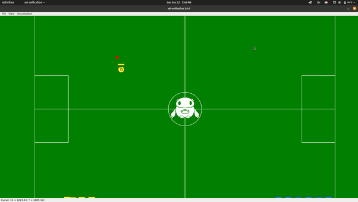

# project-unification 🇧🇷 🤖⚽
Demonstração do framework de unificação de categorias de futebol de robôs, pensado para introduzir novatos na infraestrutura de software alto-nível adotado pela equipe, tendo uma grande base de funções úteis e adaptações aos casos de uso para desenvolver a cognição em software de futebol de robôs.

## Descrição
### Arquitetura

- I: Recebemos do simulador de forma independente as informações captadas a 60FPS pelas N câmeras que tenham sidos configuradas, no caso do GrSim são 4.
- A: Após ser recebido pelo socket UDP, as informações brutas são enviadas para serem processadas e organizadas nas entidades de frame e de field.
- 1: Ao formatar as informações recebidas o processingWorld pode enviar aos módulos inscritos constantemente a versão atualizada das suas entidades de output.
- B: Quando o behavior define como o robô deve atuar, uma das principais ações atribuídas é a movimentação, com isso precisamos filtrar obstáculos entre o robô e os objetivos atribuídos.
- C: Após filtrar as instruções de movimentação do robô, enviamos todo o Behavior para o Navigation que processa a navegação em movimentações diretas para o robô.
- 2: Após processar a navegação, é construído o pacote de comando para robô que é enviado para o sendCommands.
- II: Sempre que o sendCommands recebe um pacote de comandos para o robô esse pacote é enviado para o simulador através da conexão UDP


**Nota**:Módulos com a marcação "Done" São plenamente funcionais, enquanto os com a marcação "ToDo" possuem funcionalidade limitada ou nenhuma.

### MouseAndKeyBoard
 GoToPoint                 | RotatePoint              |           RotateOnSelf  |
:-------------------------:|:-------------------------:|:-------------------------:
   |   |  | 
tecla T      | tecla U   |  tecla I  |
 
 
- O exemplo disponível exercita apenas a movimentação dos robôs, mas ao preenchendo outros campos e com algumas modificações é possível usar outras funções do robô. Para mais detalhes verifique os comandos disponíveis em [RobotCommand.h](https://github.com/robocin/project-unification/blob/main/src/Packages/RobotCommand/RobotCommand.h).
- O behavior TurnedOff existe apenas para ser possível desligar um robô e precisa ser mantido como está, mas o behavior de mouseAndKeyBoard pode ter sua base copiada e alterada a vontade para fazer o projeto 😁

## Dependências
- Compilador g++ 9.3 ou superior, como presente no Ubuntu >= 20.04 ou similares.
- VSCode, editor utilizado pela equipe e com plugins fornece total supporte ao projeto.

## Setup de ambiente
- Para instalar as dependências essenciais do projeto execute no terminal:
```bash
$ cd scripts
$ sudo ./setup.py --essentials
```
- Para configurar o VSCode:
  - Abra a pasta do projeto no VScode
  - Abra o terminal integrado do VSCode
  - Execute os seguintes comandos no terminal
  ```bash
  $ cd scripts
  $ ./vscode-cpp-essentials.sh
  ```
  - Ative o formmatter seguindo os passos:
   - Navegue pela interface nas opções: File > Preferences > settings
   - Busque pelo campo "Editor: Default Formatter" em settings e selecione o clang-format como formatter.
- Todo o processo de setup pode ser conferido no vídeo de setup [aqui](https://drive.google.com/file/d/1NFFaG4YJ6j1qvTHhRYu3boERr167gtf5/view?usp=sharing)
