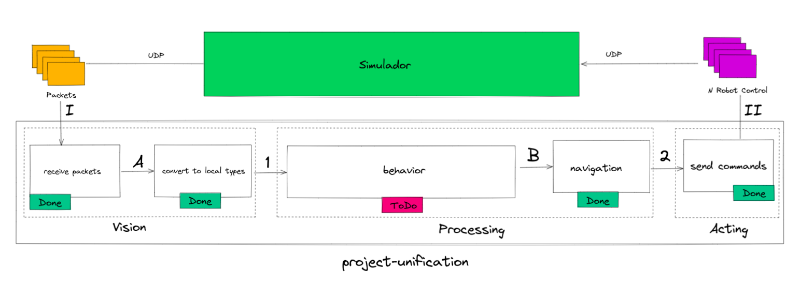
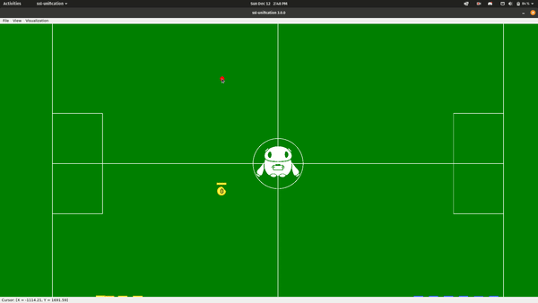
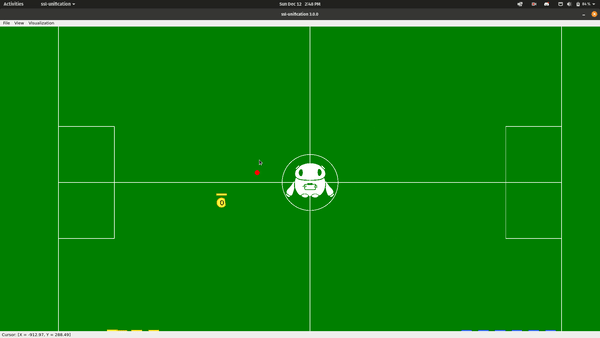

# project-unification 🇧🇷 🤖⚽

Esse projeto tem como objetivo demonstrar uso do framework [soccer-common](https://github.com/robocin/soccer-common), desenvolvido pelo RobôCIn e utilizado nas categorias [RobôCup SSL](https://ssl.robocup.org/) e [IEEE VSS](https://ieeevss.github.io/vss/);

## Descrição

### Arquitetura



*Módulos com a marcação "done" são minimamente funcionais, enquanto os com a marcação "todo" é esperado que sejam implementados;*

#### Vision

-   **I**: Recebe, a partir de um software externo (ex: [grSim](https://github.com/RoboCup-SSL/grSim), para o SSL e [FIRASim](https://github.com/VSSSLeague/FIRASim) para o VSS) as informações correspondentes a visão;

-   **A**: Realiza a leitura das informações e converte em tipos locais ([Field](https://github.com/robocin/soccer-common/blob/master/include/soccer-common/Field/Field.h), [Ball](https://github.com/robocin/soccer-common/blob/master/include/soccer-common/Entities/Ball/Ball.h), [Robot](https://github.com/robocin/soccer-common/blob/master/include/soccer-common/Entities/Robot/Robot.h));

-   **1**: Após a conversão em tipos locais, as entidades, _ball_, _allies_ e _enemies_ são agrupadas em uma classe [Frame](https://github.com/robocin/project-unification/blob/main/src/Packages/Frame/Frame.h) e enviadas para o módulo seguinte, a classe Field também é enviada de acordo com sua frequência de recebimento;

*Nesse projeto, apenas uma demonstração funcional do recebimento de pacotes pelos simuladores é realizada, isto é, não há uma filtragem robusta das informações recebidas, nem cálculos para a obtenção de velocidade e aceleração das entidades;*

#### Processing

-   **B**: Nessa etapa é esperado que, a partir das informações recebidas de Frame e Field, exista uma definição de como o robô deve atuar. Nesse projeto, a atuação dos robôs foi abstraída nas classes [SSLRobotCommand](https://github.com/robocin/project-unification/blob/main/src/Packages/SSLRobotCommand/SSLRobotCommand.h) e [VSSRobotCommand](https://github.com/robocin/project-unification/blob/main/src/Packages/VSSRobotCommand/VSSRobotCommand.h);
-   **2**: Após a definição do que o robô deve fazer, as classes [SSLNavigation](https://github.com/robocin/project-unification/blob/main/src/Modules/Processing/ProcessingUtils/SSLNavigation/SSLNavigation.h) e [VSSNavigation](https://github.com/robocin/project-unification/blob/main/src/Modules/Processing/ProcessingUtils/VSSNavigation/VSSNavigation.h) convertem os comandos abstraídos em pacotes interpretáveis pelos simuladores, para que possam realizar efetivamente o comportamento desejado. Os commandos finais para as categorias são as classes existentes no arquivo [Command](https://github.com/robocin/project-unification/blob/main/src/Packages/Command/Command.h), e ao final do módulo, são enviados para o módulo seguinte;

#### Acting

-   **II**: Como ultima etapa, para cada pacote construído em **Processing**, um envio para o simulador é realizado, concluindo assim, a realização do comportamento desejado;

---

## Processing Modules
### MouseAndKeyboard

- O Módulo MouseAndKeyboard existe para demonstrar algumas ações default que os robôs podem realizar. Os comandos para o SSL e o VSS podem ser visualizados abaixo:

#### SSL (Default Keys):
 |         GoToPoint         |          RotatePoint          |         RotateOnSelf         |
 | :-----------------------: | :---------------------------: | :--------------------------: |
 |  |  |  |
 |          tecla T          |            tecla U            |           tecla I            |

#### VSS (Default Keys):
 | GoToPoint | RotateCCW | RotateCW |
 | :-------: | :-------: | :------: |
 |  tecla T  |  tecla Z  | tecla X  |

### TurnedOff
- O Módulo TurnedOff existe apenas para "desligar" um robo;

## Dependências

- Sistema Operacional: Ubuntu 20.04 LTS ou superior:
Qualquer outro sistema operacional pode requerer scripts de instalação diferentes dos fornecidos ou não funcionar;

- [CMake](https://cmake.org/) 3.15 ou superior;
- [C++17](https://en.cppreference.com/w/cpp/17) ou superior:
    - _gcc ≥ 9;_
    - _Algumas features utilizadas existem apenas a partir do C++17;_
- [Qt Framework](https://www.qt.io/) 6.1.1 ou superior:
    - _Algumas dependências requerem o Qt;_
- [Google Protobuf](https://developers.google.com/protocol-buffers);
- OpenGL;
- [boost](https://www.boost.org/):

> todas as dependências requeridas podem ser instaladas através do script: `scripts/setup.py`

É recomendado o uso do [VSCode](https://code.visualstudio.com/) IDE;

> O VSCode pode ser instalado atráves do comando: _$ snap install --classic code_

## Setup

-   Para instalar as dependências essenciais do projeto execute no terminal:

$ cd scripts
$ sudo ./setup.py --essentials

-   Para configurar o VSCode:

$ cd scripts
$ sudo ./setup.py --install vscode-cpp-essentials
    
-   Ative o formmatter seguindo os passos:
-   Navegue pela interface nas opções: File > Preferences > settings
-   Busque pelo campo "Editor: Default Formatter" em settings e selecione o clang-format como formatter.

*O script setup.py requer os comandos ```apt update``` e ```apt upgrade``` funcionado. Caso contrário, vá na pasta scripts/ubuntu e instale manualmente cada um dos scripts desejados*

*Os scripts essenciais estão listado no arquivo ```scritps/essentials.txt```*